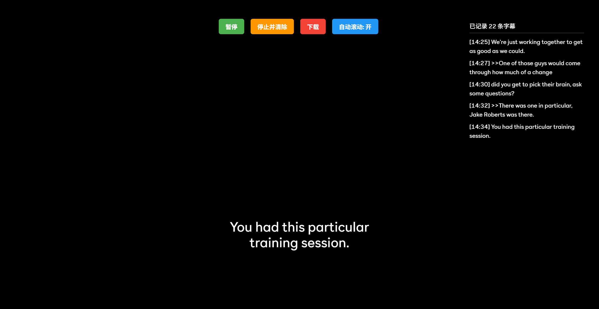

# Peacock字幕保存器 (Peacock Subtitle Saver)

## 简介
Peacock字幕保存器是一款专为Peacock TV设计的用户脚本，可自动记录视频播放中的字幕并保存为.txt文件，方便后续使用。

## 功能特点
- 自动捕获Peacock TV播放器中显示的字幕
- 实时预览已捕获的字幕
- 带时间戳记录字幕
- 一键下载字幕为TXT文件
- 支持暂停/继续记录
- 自动滚动预览面板
- 清晰美观的用户界面

## 安装方法
1. 首先安装一个用户脚本管理器：
   - Chrome/Edge: [Tampermonkey](https://www.tampermonkey.net/)
   - Firefox: [Greasemonkey](https://addons.mozilla.org/en-US/firefox/addon/greasemonkey/) 或 [Tampermonkey](https://www.tampermonkey.net/)
2. 点击以下链接安装脚本：
   - [安装Peacock字幕保存器](https://greasyfork.org/scripts/528126)

## 使用方法
1. 访问 Peacock TV 并开始播放任意视频
2. 脚本会自动在页面顶部显示控制按钮
3. 点击"开始记录"按钮开始捕获字幕
4. 使用"暂停"按钮暂时停止记录
5. 点击"下载"按钮将捕获的字幕保存为TXT文件
6. 使用"停止并清除"按钮重置所有已捕获的字幕
7. 通过"自动滚动"按钮控制预览面板的滚动行为

## 界面说明

- **开始记录/暂停**：切换字幕捕获状态
- **停止并清除**：停止记录并清除所有已捕获的字幕
- **下载**：将捕获的字幕保存为TXT文件
- **自动滚动**：控制预览面板是否自动滚动显示最新字幕

## 注意事项
- 脚本仅在Peacock TV的播放页面自动激活
- 字幕文件会包含视频标题（如果可获取）和时间戳信息
- 预览面板显示最近捕获的5条字幕
- 离开播放页面时脚本会自动清理界面元素

## 技术支持
如有问题或建议，请联系作者：liibang@foxmail.com

## 许可证
本项目采用[MIT许可证](https://opensource.org/licenses/MIT)